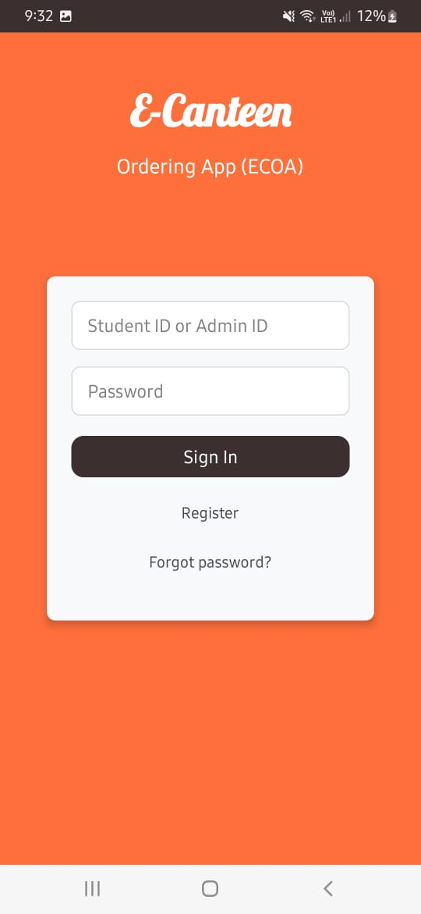
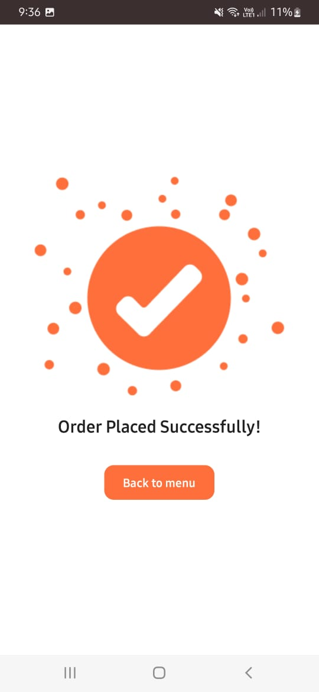

# E-Canteen Ordering App 🍽️

A comprehensive Android application for digital canteen ordering system with admin dashboard, order management, and real-time tracking capabilities.

## 📱 Overview

The E-Canteen Ordering App is a modern Android application designed to streamline the canteen ordering process for educational institutions. It provides separate interfaces for students and administrators, enabling seamless food ordering, payment processing, and order management.

## ✨ Key Features

### 👨‍🎓 Student Features
- **User Registration & Login** - Secure account creation with email verification
- **Food Menu Browsing** - Browse available food items with prices and descriptions
- **Shopping Cart** - Add/remove items, adjust quantities
- **Multiple Payment Options** - Cash, bKash, and Nagad payment integration
- **Order Tracking** - Real-time order status updates (Confirmed → Preparing → Out for Delivery)
- **Profile Management** - User profile with personal information
- **Order History** - View past orders and their status

### 👨‍💼 Admin Features
- **Dashboard Overview** - Centralized admin control panel
- **Menu Management** - Add, edit, and remove food items
- **Order Management** - View all orders with detailed information
- **Order Status Control** - Update order progress through status checkboxes
- **Sales Reports** - Comprehensive sales analytics with date filtering
- **AI Suggestions** - Smart recommendations for inventory management
- **Real-time Updates** - Live order status synchronization

### 🎨 UI/UX Features
- **Modern Material Design** - Clean, intuitive interface
- **Responsive Layout** - Optimized for various screen sizes
- **Animated Welcome Screen** - Engaging video introduction
- **Status Chips** - Visual order status indicators
- **Color-coded Elements** - Intuitive visual feedback
- **Empty State Handling** - User-friendly no-data messages

## 🛠️ Technical Stack

### Frontend
- **Language**: Java
- **UI Framework**: Android SDK
- **Architecture**: Activity-based with proper separation of concerns
- **Video Player**: ExoPlayer for welcome screen animations

### Backend & Data
- **Local Database**: Room Persistence Library
- **Data Models**: 
  - `FoodItem` - Food menu items
  - `CartItem` - Shopping cart items
  - `Order` - Order information
  - `OrderItem` - Individual items in orders
  - `OrderStatus` - Order tracking status

### Key Dependencies
```gradle
// Room Database
implementation "androidx.room:room-runtime:2.4.3"
implementation "androidx.room:room-compiler:2.4.3"

// ExoPlayer for video
implementation "com.google.android.exoplayer:exoplayer:2.19.1"
implementation "com.google.android.exoplayer:exoplayer-ui:2.19.1"

// AndroidX Libraries
implementation "androidx.appcompat:appcompat:1.6.1"
implementation "com.google.android.material:material:1.9.0"
```

## 📁 Project Structure

```
E-Canteen-Ordering-App/
├── app/
│   ├── src/main/
│   │   ├── AndroidManifest.xml
│   │   ├── java/com/example/e_canteenorderingapp/
│   │   │   ├── WelcomeActivity.java
│   │   │   ├── OrderTrackingActivity.java
│   │   │   ├── PaymentActivity.java
│   │   │   ├── admin/
│   │   │   │   ├── AdminHomeActivity.java
│   │   │   │   ├── AdminDashboardActivity.java
│   │   │   │   ├── AdminOrdersActivity.java
│   │   │   │   ├── AdminOrderDetailActivity.java
│   │   │   │   ├── AdminSalesReportActivity.java
│   │   │   │   ├── AdminAiSuggestionActivity.java
│   │   │   │   ├── AdminOrdersAdapter.java
│   │   │   │   └── OrderItemsAdapter.java
│   │   │   ├── student/
│   │   │   │   ├── StudentHomeActivity.java
│   │   │   │   ├── ProfileActivity.java
│   │   │   │   └── CartActivity.java
│   │   │   ├── data/
│   │   │   │   ├── AppDatabase.java
│   │   │   │   ├── Order.java
│   │   │   │   ├── OrderItem.java
│   │   │   │   └── OrderDao.java
│   │   │   └── util/
│   │   │       └── FormatUtils.java
│   │   └── res/
│   │       ├── layout/
│   │       │   ├── activity_welcome.xml
│   │       │   ├── activity_order_tracking.xml
│   │       │   ├── activity_admin_dashboard.xml
│   │       │   ├── activity_admin_orders.xml
│   │       │   ├── item_admin_order.xml
│   │       │   ├── activity_admin_order_detail.xml
│   │       │   ├── item_admin_order_detail_line.xml
│   │       │   ├── activity_admin_sales_report.xml
│   │       │   └── activity_admin_ai_suggestion.xml
│   │       ├── values/
│   │       │   ├── colors.xml
│   │       │   ├── strings.xml
│   │       │   └── themes.xml
│   │       └── values-night/
│   │           └── themes.xml
│   └── build.gradle.kts
├── screenshots/
├── build.gradle.kts
├── settings.gradle.kts
├── gradle/
├── gradlew
└── gradlew.bat
```

## 🚀 Getting Started

### Prerequisites
- Android Studio (Latest version recommended)
- Android SDK API 24+ (Android 7.0)
- Java 8 or higher

### Installation

1. **Clone the repository**
   ```bash
   git clone https://github.com/sarawer/E-Canteen-Ordering-App.git
   ```

2. **Open in Android Studio**
   - Launch Android Studio
   - Select "Open an existing project"
   - Navigate to the cloned directory

3. **Sync Project**
   - Let Android Studio sync the Gradle files
   - Ensure all dependencies are downloaded

4. **Build and Run**
   - Connect an Android device or start an emulator
   - Click "Run" or press `Shift + F10`

### Database Setup
The app uses Room database which automatically creates tables on first run. No manual database setup is required.

## 📊 Admin Dashboard Features

### Order Management
- **Order List View**: Shows all orders with status chips
- **Order Details**: Complete order information including:
  - Student name and table number
  - Estimated delivery time
  - Ordered items with quantities and prices
  - Status update checkboxes (Confirm → Preparing → Out for Delivery)

### Sales Reports
- **Date Filtering**: Today, Yesterday, Pick Date, Pick Range
- **Summary Cards**: Total orders and total revenue
- **Item-wise Sales**: Detailed breakdown of sold items
- **Currency Formatting**: Proper BDT (৳) formatting
- **Empty State**: User-friendly messages when no data available

### AI Suggestions
- **Analytics**: Total orders and items sold
- **Top Sellers**: Best-performing food items
- **Smart Recommendations**: Inventory and menu suggestions

## 🎯 User Workflows

### Student Ordering Process
1. **Registration/Login** → Account creation or sign-in
2. **Browse Menu** → Select food items from available menu
3. **Add to Cart** → Adjust quantities and review items
4. **Payment** → Choose payment method (Cash/bKash/Nagad)
5. **Order Confirmation** → Receive order confirmation
6. **Track Order** → Monitor order status in real-time

### Admin Management Process
1. **Login** → Access admin dashboard
2. **Manage Orders** → Review and update order statuses
3. **Generate Reports** → Analyze sales data and trends
4. **Menu Management** → Update food items and pricing
5. **AI Insights** → Review suggestions for improvements

## 🔧 Configuration

### App Configuration
- **Database Version**: 5 (includes all entities and relationships)
- **Target SDK**: 34 (Android 14)
- **Min SDK**: 24 (Android 7.0)

### Customization
- **Colors**: Modify `res/values/colors.xml` for theme colors
- **Strings**: Update `res/values/strings.xml` for text content
- **Images**: Replace drawable resources for custom branding

## 📱 Screenshots

### Welcome & Authentication
<div align="center">
  
  
  
</div>

### Student Interface
<div align="center">
  
  
  
  
</div>

### Admin Dashboard
<div align="center">
  
  
  
  
  
</div>

## 🧪 Testing

### Manual Testing
The project includes comprehensive manual testing scenarios covering:
- User registration and login flows
- Order placement and tracking
- Admin dashboard functionality
- Payment processing
- Sales report generation

### Test Cases
Refer to the manual testing documentation for detailed test scenarios and expected outcomes.

## 🤝 Contributing

1. Fork the repository
2. Create a feature branch (`git checkout -b feature/AmazingFeature`)
3. Commit your changes (`git commit -m 'Add some AmazingFeature'`)
4. Push to the branch (`git push origin feature/AmazingFeature`)
5. Open a Pull Request

## 📄 License

This project is licensed under the MIT License - see the [LICENSE](LICENSE) file for details.

## 👨‍💻 Author

**Sarawer** - [GitHub Profile](https://github.com/sarawer)

## 🙏 Acknowledgments

- Android development community for resources and support
- Material Design guidelines for UI/UX inspiration
- Room database documentation for implementation guidance

## 📞 Support

For support, email sarawermd@gmail.com or create an issue in the repository.

---

**Note**: This is a demo project for educational purposes. For production use, additional security measures, payment gateway integration, and server-side components would be required.
=======

